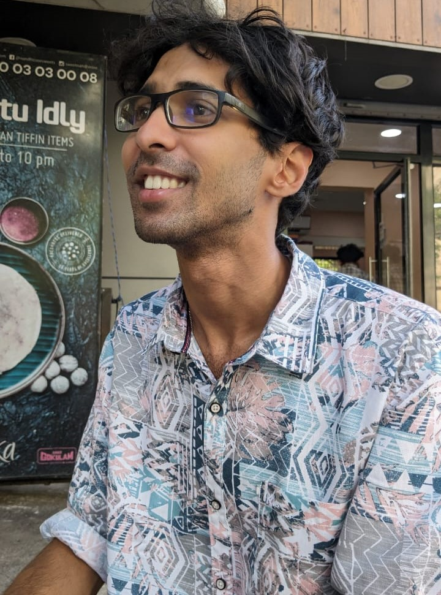

  
  
 I'm a research scholar at the Indian Institute of Technology, Madras. My Bachelors's and Master's were from the same institute in Engineering Design with a specialization in automotive engineering. I also have a minor in physics. Currently, I work on particle-based modeling techniques for solids and fluids. Other than work, I'm passionate about ancient history, the evolution of religion, philosophy, astronomy, and music. You can check out my blog, where I post my thoughts.

.container {
  display: flex;
  align-items: center;
}

img {
  margin-right: 10px;
}
