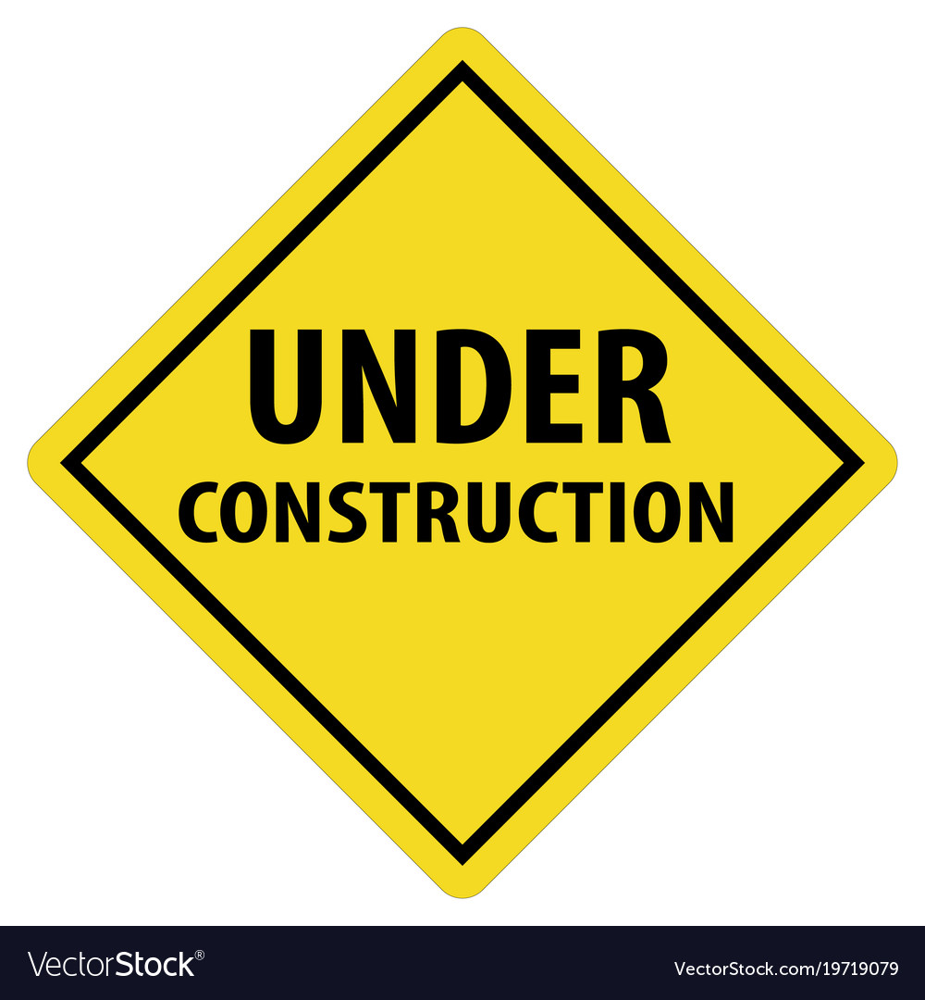

<html>
  <head>
    <title>Pretty Paris</title>
  </head>
  
  <body>

<h4 class="heading-text">Developing a novel fluid-structure interaction(FSI) framework </h4>

  

     
      

      

        <h1></h1>
      

  <h4 class="heading-text">Learning inter-particle interaction forces from trajectories using deep learning </h4>
  
  
  

     
      

      

        <h1></h1>
      

  <h4 class="heading-text">Estimating the reamining life of a drive bearing due toi electric erosion</h4>
  

  

     
      

      

        <h1></h1>
      

 <body>
 <html>
