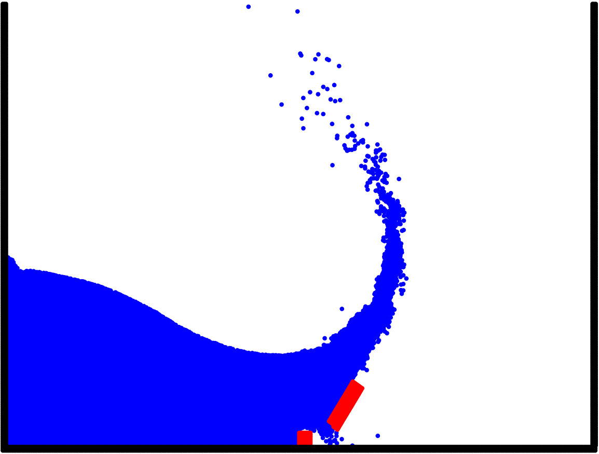

<html>
  <head>
    <title>Pretty Paris</title>
  </head>
  
  <body>

   <h4 class="heading-text">Project-1 </h4>
  

     
      

      

        <h1>I'm a research scholar at the Indian Institute of Technology, Madras. My Bachelors's and Master's were from the same institute in Engineering Design with a specialization in automotive engineering. I also have a minor in physics. Currently, I work on particle-based modeling techniques for solids and fluids. Other than work, I'm passionate about ancient history, the evolution of religion, philosophy, astronomy, and music. You can check out my blog, where I post my thoughts.</h1>
      

  <h4 class="heading-text">Project-2 </h4>
  

     
      

      

        <h1>I'm a research scholar at the Indian Institute of Technology, Madras. My Bachelors's and Master's were from the same institute in Engineering Design with a specialization in automotive engineering. I also have a minor in physics. Currently, I work on particle-based modeling techniques for solids and fluids. Other than work, I'm passionate about ancient history, the evolution of religion, philosophy, astronomy, and music. You can check out my blog, where I post my thoughts.</h1>
      

  <h4 class="heading-text">Project-3 </h4>
  

     
      

      

        <h1>I'm a research scholar at the Indian Institute of Technology, Madras. My Bachelors's and Master's were from the same institute in Engineering Design with a specialization in automotive engineering. I also have a minor in physics. Currently, I work on particle-based modeling techniques for solids and fluids. Other than work, I'm passionate about ancient history, the evolution of religion, philosophy, astronomy, and music. You can check out my blog, where I post my thoughts.</h1>
      

 <body>
 <html>
